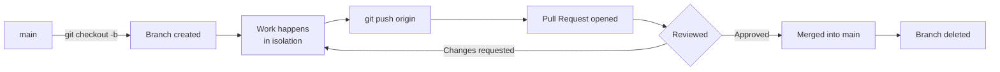

# Diagram: The Branch Lifecycle

Every branch — feature, bugfix, or hotfix — follows the same path from creation to deletion.

Short-lived branches — days, not weeks — stay close to `main` and rarely produce painful merge conflicts. A branch that lingers open for weeks has usually drifted far enough from `main` that merging it back becomes its own project. See [branch naming examples](../examples/02-branch-naming-examples.md) for how to name what you create here.
