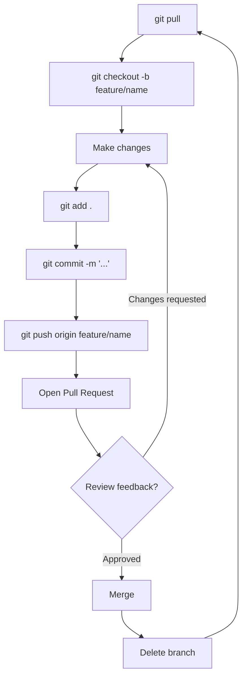

# Diagram: The Daily Workflow Loop

The repeating cycle covered in the [cheat sheet](../cheatsheet/git-github-cheatsheet.md) and [example walkthrough](../examples/01-daily-workflow.md).

Every step supports one goal: keep work isolated, traceable, and mergeable. If a step gets skipped — especially the pull at the start or the review before merge — this is usually where problems start.
