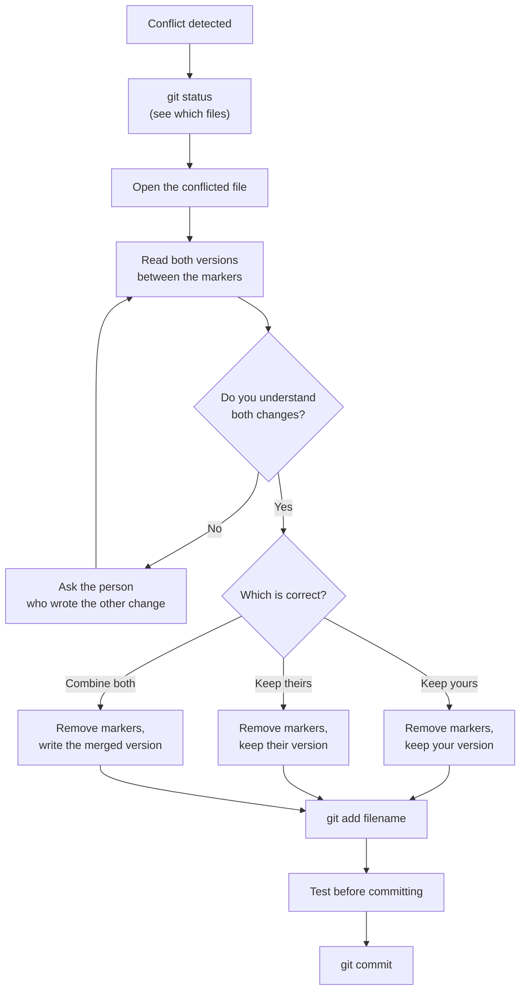

# Diagram: Merge Conflict Resolution Flow

The decision process from [Exercise 2](../exercises/02-simulate-a-merge-conflict/README.md) and the [worked example](../examples/04-resolving-a-merge-conflict.md), as a flowchart.

The one rule that matters most here: never guess. If you don't understand both sides of the conflict, that's a two-minute conversation, not a coin flip.
